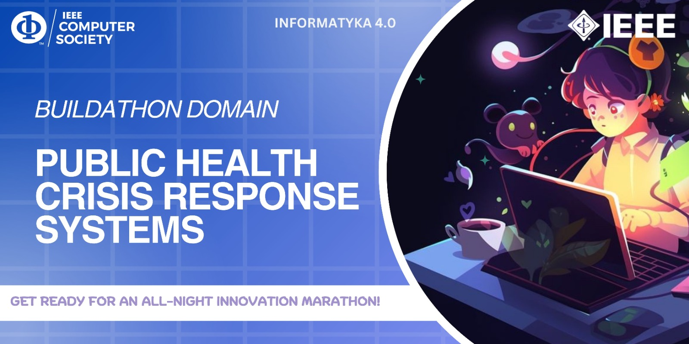

# {ResQ} - BUILDATHON
To develop an integrated platform that tracks the availability of medical resources and predicts demand, enabling efficient management and allocation during health crises.

## Team Members
[1.Anit K T](Anit-K-T)   
[2.Anna BInto](AnnaBinto)   
[3.Aswitha Vishwanath](aswithaa22)   
[4.Navami Jinesh](Navamijinesh)   

## Link to Project
[Embed the live link of project](live_link)

## How it Works ?
During crises, managing resources like hospital beds, oxygen, and vaccines is a major challenge.
 We Build a system that tracks availability and predicts demand for medical resources, helping hospitals and governments manage supplies efficiently.

 

## Technologies used
List out tech stacks you have used

## Other Links
Provide any other links ( for eg. Wireframe , UI, Abstract, Presentation )
